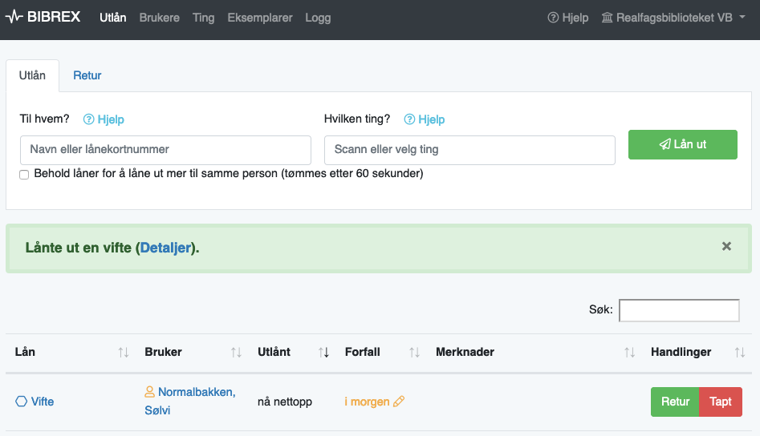

## BIBREX

Bibrex is a simple system to manage and circulate things that are not well fit for bibliographic description and inclusion in the library catalogue, such as extension coords and other cables, computers, cameras, calculators and so on.
Users can be created locally, but also imported from Alma.
The system is created for use by librarians, not end users.

Functionality:

- Two-level data model based on Things and Items, where the Thing is the generalization and the Item is a concrete physical item with a barcode/RFID tag.
- Alma user integration
- Loan time can be customized per thing and per loan.
- Reminders sent in the user's preferred language (currently support for Bokmål, Nynorsk or English)
- GDPR friendly. See section on privacy below.

Missing functionality:

- Reservations
- Discovery/search for end users. We have a very simple public status display.
- No support for kits with multiple parts with their own barcode/RFID tag.

### Setup for development

Requirements: Quite recent versions of PHP (see `composer.json` for required version),
NodeJS and PostgresSQL.

#### Database setup

Bibrex mostly make use of the database-agnostic layer provided by Laravel,
but has a few couplings to PostgresSQL through the use of Postgres-specific functionality like
the [CITEXT](https://www.postgresql.org/docs/9.1/citext.html) and
[JSONB data types](https://www.postgresql.org/docs/9.4/datatype-json.html),
and the [ILIKE operator](https://www.postgresql.org/docs/8.3/functions-matching.html).
It shouldn't be too much effort to make it work with another databse if needed,
but it's definitely easier to get started with Postgres.

For a local setup, start by creating a Postgres user, and a database:

    $ createuser --pwprompt bibrex_dev
    $ createdb --owner=bibrex_dev --encoding=utf8 bibrex_dev
    $ psql -d bibrex_dev -c 'CREATE EXTENSION citext;'

Add the credentials to the `.env` file.

#### Building the app

1. `composer install` to fetch PHP dependencies.
2. Add database setup etc. to the `.env` file.
3. `php artisan migrate` to create the database tables
4. Optional:
   `php artisan db:seed` to seed the database with an admin user
    ("post@eksempelbiblioteket.no", password "admin") and a few demo things.
5. Make sure `app/storage` is writable by the www user.
6. `npm install` to fetch NodeJS dependencies.

PHP settings: You might want to increase `upload_max_filesize` to `10M` or to taste
to allow users to upload larger images.
Bibrex will make thumbnails for you, so larger files pose no problem really.

#### Running a development server

* Run `php artisan serve` to start a dev server on localhost:8000,
  or use [Valet](https://laravel.com/docs/5.8/valet).

* If you're working on frontend stuff (things in the `resources/assets` folder),
  run `npm run watch` to re-build the JS/CSS.

#### Update OpenAPI documentation for Swagger UI:

    ./vendor/bin/openapi app -o public/openapi.json

#### Refreshing the database

Disable logging to database when refreshing the database:

    LOG_CHANNEL=single php artisan migrate:refresh

### Production

A `deploy.php` file is included for deploying the app with
[Deployer](https://deployer.org/).
This contains all the information needed to deploy the app.

### Tests

To run browser tests, download and start Selenium, then run `artisan dusk`

    wget https://selenium-release.storage.googleapis.com/3.141/selenium-server-standalone-3.141.59.jar
    java -jar selenium-server-standalone-3.141.59.jar &
    TEST_BROWSER=chrome php artisan dusk

Unfortunately, testing with Firefox doesn't work at the moment due to an incompability between Selenium and php-webdriver.
See https://github.com/facebook/php-webdriver/issues/469.

Continuous integration browser testing supported by  

### Privacy

Bibrex includes a couple of Artisan commands to enhance users' privacy
and support the [data minimisation principle](https://ico.org.uk/for-organisations/guide-to-data-protection/guide-to-the-general-data-protection-regulation-gdpr/principles/data-minimisation/):

* `bibrex:anonymize` anonymizes all returned loans, by re-linking the
  loans with a special system user, so that the link between loan and user
  is lost. By default, Bibrex will run this every night.

* `bibrex:purge-logs` deletes log entries older than the limit specified
  in the `config/logging.php` config file. By default, Bibrex will keep
  logs for 7 days.

* `bibrex:purge-notifications` deletes notifications older than the limit
  specified in the `config/bibrex.php` config file. By default, Bibrex will
  keep notifications for 3 months.

* `bibrex:purge-users` deletes inactive users. By default, Bibrex will keep
  imported users for 3 months and local users for 3 years. Imported users can
  be re-imported at any time, so in principle they could be kept even shorter,
  but looking up a user and checking out an item will both be considerably
  faster when we have a local copy, so some storage time makes sense.
  For local users, the user information have to be manually entered again if
  a user comes back after having been deleted, so a longer storage time makes
  sense. It's advised to try to limit the number of local users.

### Større endringer

* [2019-07-10](https://github.com/scriptotek/bibrex/commit/12989de79476134710324d54dfabbe87dc27f869) Støtte for flere identifikatorer per bruker, f.eks. flere lånekort.
* [2019-02-06](https://github.com/scriptotek/bibrex/commit/28b56049f09c4cb07908bf4e850195c68797c24d) Lagt til et enkelt API.
* [2019-01-14](https://github.com/scriptotek/bibrex/commit/3696480580898a5f2324cf2c7c85a86cdf3c8908) Automatisk sletting av inaktive brukere og gamle varsler.
* [2018-02-12](https://github.com/scriptotek/bibrex/commit/c700caf4a9508679643f45b66af5cd5dd0e1c4b2) Påminnelser og Alma-import av brukerdata.
* [2016-18-10](https://github.com/scriptotek/bibrex/commit/ae059198c7f0a59a94e1742914060d53f75efdaf) Anonymisering av utlån.
* [2013-11-04](https://github.com/scriptotek/bibrex/commit/d8377cd1e2aa8feec105d2a106a0f172d7cba908) Institusjonsbasert pålogging, med mulighet for autopålogging fra bestemte IP-adresser.
* [2013-10-19](https://github.com/scriptotek/bibrex/commit/4e6263c7760dfb9bafe9a4996637b8f231bf18c6) Sync som Artisan-kommando for enkel kjøring fra cron.
* [2013-09-09](https://github.com/scriptotek/bibrex/commit/7a90441e68396e1ad3d6ebb2c3add1b30d680760) Sync: Hvis LTID har blitt aktivert i BIBSYS blir lån gjort på midlertid kort automatisk overført til brukerens LTID.
* [2013-09-09](https://github.com/scriptotek/bibrex/commit/394c3e4608114e4fba9e00b9fe58d78f8ef8f001) Mulighet for å deaktivere ting for utlån
* [2013-09-05](https://github.com/scriptotek/bibrex/commit/0ae2d9e929da84ced1520fa676c83b280683e767) Mulighet for å slette ting, men bare hvis ikke utlånt enda

